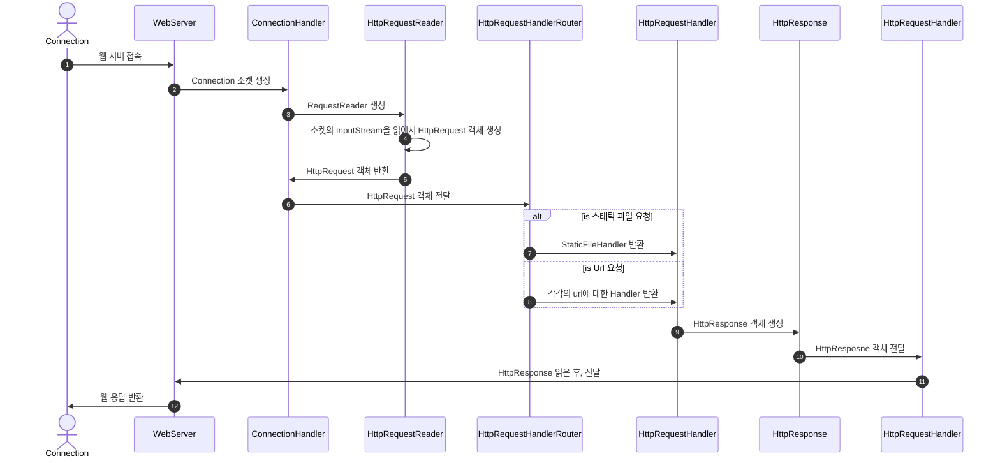

# be-was-2024

코드스쿼드 백엔드 교육용 WAS 2024 개정판

---

# 📖 주간 학습 계획

- ```docs/week1.md``` 에 위치합니다.

# 🖥️ 프로그램 동작



# 🤯 마주쳤던 문제들

## 1) 접속 시, 무한 로딩이 걸리던 문제

### 문제 상황

- 접속을 할 때, 웹사이트가 계속 🔄 표시가 났다.
- 서버 접속을 끊었더니, 웹사이트가 정상적으로 나타나는 문제가 있었다.

### 해결!

- InputStream으로 Request를 읽을 때, ```Auto Close```를 하지 않아, 자원을 계속 읽어들이던 문제!
- ```try-with-resources``` 문법 사용의 유무!

```
* 문제 코드

try{
    BufferedReader br = new BufferedReader(new InputStreamReader(in));
} ...
```

- ```InputStream```의 경우에는 ```Closeable```을 implements하여서, 자원을 free 해주어야 한다.
- 위의 코드에서, 사용 후 auto close를 해주지 않기 때문에 계속 자원을 읽는다.
- try catch finally문의 close를 자동으로 close 해주기 때문에 사용하자!

```
try(BufferedReader br = new BufferedReader(new InputStreamReader(in)){
...
} ...
```

- resource auto close를 해주어 해결

## 2) abstract class로 구현했더니, 구조가 너무 복잡해짐! 

### 문제 상황
- abstract class를 사용하면서 구조가 복잡해지고, 사용하지 않아도 되는 abstract class를 사용하면서 수정할 점이 생기면 모든 상속받는 클래스들을 수정해주어야해서, 복잡도가 더욱 늘어났다.

### 해결!
- interface를 활용해서 handle가 하는 일을 정할 수 있도록 구현하였다.
- UrlHandlerFactory [팩토리 패턴]을 사용하여, url에 대한 handler가 매핑될 수 있도록 하였다.

## 3) POST URL 처리..?

### 문제 상황
- post Handler를 하나만 만들다 보니, post로 들어오는 다양한 url의 요청을 처리해주지 못하였다.

### 해결
- URL Enum과 Factory 패턴을 활용하여 개선!
```java
LOGIN("/login"),
REGISTRATION("/registration"),
MAIN("/main"),
LOGOUT("/logout");
```
- enum을 활용하여 url 경로를 미리 매핑해두었다.
```java
public UrlHandler createUrlHandler(Url url) {
    return switch (url) {
        case REGISTRATION -> new RegistrationHandler();
        case LOGIN -> new LoginHandler();
        case MAIN -> new MainHandler();
        case LOGOUT -> new LogoutHandler();
    };
}   
```
- UrlHandlerFactory를 사용하여 각각의 url에 대한 handler를 리턴해줄 수 있도록 하였다.

> 이를 통해 각각 url에 따른 처리를 해줄 수 있었다.
> GET, POST에 대한 처리를 handler 내부에서 각각 해줄 수 있었다.
> 또한, 해당 url로 들어오는 또다른 url값들을 처리해줄 수 있었다.


---

# 고민해보아야 할 문제

## 1) Config ..
- Config은 port, static_route와 같은 정보들이 포함되어있는 config.yaml파일을 읽어서 저장한다.
- 이 값들이 여기저기서 필요하게 되면서, config 객체를 지속적으로 넘겨주어야 하는 문제가 발생하였다.
- config을 static으로 관리하여 config의 정보가 필요한 객체에서 바로 가져올 수 있도록 하는 방법을 생각해보아야겠다.

### 해결
- Config 클래스의 메소드를 static으로 선언하여 config 객체를 넘겨주지 않도록 수정
---