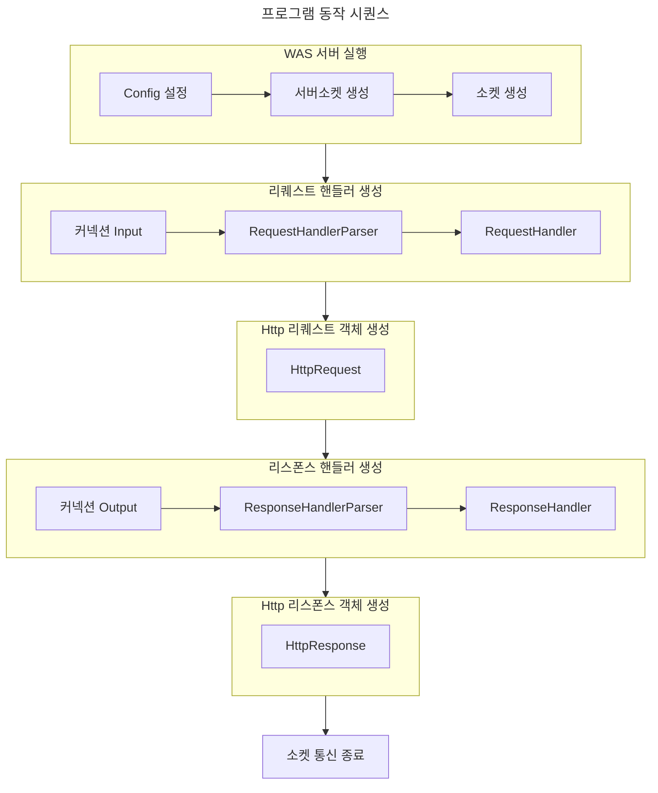

# be-was-2024

코드스쿼드 백엔드 교육용 WAS 2024 개정판

---

# 📖 주간 학습 계획

- ```docs/week1.md``` 에 위치합니다.

# 🖥️ 프로그램 동작



# ✏️ 구현해보고자 한 것

## ```Abstract Class```로 만들어서 가독성 있는 코드를 만들어보자

### ```RequestHandler```, ```ResponseHandler```

- ```handler.handleRequest```, ```handler.handleResponse``` 동작으로만 동작이 이루어지게 구성하였습니다.

### ```HttpRequest```, ```HttpResponse```

- 객체에 따라 Body가 있는 것도, 없는 것도 있기 때문에 이를 선택적으로 구현하고자 하였습니다.

### 고찰

- 무조건적인 abstract class를 사용하다 보니, 구조가 복잡해진 것 같습니다.
- 사용하다보니, interface도 사용해보면 좋을 것 같다는 생각을 하였습니다.
- package 구조를 일관성있게 구조화하지 못한 것 같습니다.
- instanceof 라는 메소드를 사용하여 구현하는 것이 좋은 방법인가에 대해 생각..

---

# 🤯 마주쳤던 문제들

## 1) 접속 시, 무한 로딩이 걸리던 문제

### 문제 상황

- 접속을 할 때, 웹사이트가 계속 🔄 표시가 났다.
- 서버 접속을 끊었더니, 웹사이트가 정상적으로 나타나는 문제가 있었다.

### 해결!

- InputStream으로 Request를 읽을 때, ```Auto Close```를 하지 않아, 자원을 계속 읽어들이던 문제!
- ```try-with-resources``` 문법 사용의 유무!

```
* 문제 코드

try{
    BufferedReader br = new BufferedReader(new InputStreamReader(in));
} ...
```

- ```InputStream```의 경우에는 ```Closeable```을 implements하여서, 자원을 free 해주어야 한다.
- 위의 코드에서, 사용 후 auto close를 해주지 않기 때문에 계속 자원을 읽는다.
- try catch finally문의 close를 자동으로 close 해주기 때문에 사용하자!

```
try(BufferedReader br = new BufferedReader(new InputStreamReader(in)){
...
} ...
```

- resource auto close를 해주어 해결

