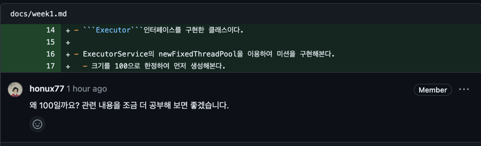

코드 리뷰 리팩토링
===

# Step -1

## 1) ThreadPool 사용


## ❌ 문제 상황
- concurrent 패키지의 threadPool에 대해 학습이 온전히 이루어지지 않은 채로, 구현을 하여 문제점이 발생하였다.
- newCachedThreadPool과 newFixedThreadPool, 그리고 직접 생성하는 ThreadPool의 차이를 이해하지 않고 사용하였다.


### ```newFixedThreadPool```
- 초기 스레드 개수는 0이고, 입력한 ```POOL_SIZE```만큼 코어 스레드가 할당된다.
- 스레드 개수보다 작업 개수가 많으면, 새 스레드를 생성한 후 작업 처리
- 이 떄, 최대 스레드 개수는 매개 값으로 준 ```POOL_SIZE```가 된다.
> 왜 이번 미션에서는 좋지 않은가?
- 해당 스레드풀에서는 스레드가 작업을 처리하지 않고 놀고 있더라도 스레드 개수가 줄지 않는다.

### ```newCachedThreadPool()```
- 초기 스레드 0, 코어 스레드 0으로 생성된다.
- 스레드 개수보다 작업 개수가 많으면 새 스레드가 생성된다.
- 이론적으로는 int값이 가질 수 있는 ```Interger.MAX_VALUE``` 값이지만, 운영체제에 따라 달라진다.
- [ ] 1개 이상의 스레드가 추가되었을 경우
  - [x] 60초 동안 추가된 스레드가 아무 작업을 하지 않을 경우, 추가된 스레드를 종료하고 pool에서 제거
> 요청이 단일적으로 .html 파일만 조회하고 회원가입을 하는 해당 프로젝트의 경우에는
> CachedThreadPool()을 사용하는 것이 효과적일 것이라고 생각했습니다.

### ```ThreadPoolExecutor 객체```
- newCachedThreadPool, newFixedThreadPool은 내부적으로 ThreadPoolExecutor 객체를 생성해서 리턴한다.
```
ExecutorService threadPool = new ThreadPoolExecutor(
    3,          // 코어 스레드 개수
    200,        // 최대 스레드 개수
    120L,       // 놀고 있는 시간
    TimeUnit.SECONDS,   // 놀고 있는 시간 단위
    new SynchronousQueue<Runnable>()    // 작업 큐
);
```
- 의 형태로 선언할 수 있다.

## ⭕️ 문제 개선
- 기존 newFixecThreadPool을 개선한다.
- ThreadPoolExecutor을 활용해서 직접 스레드 풀을 생성한다.
- ```CORE_THREAD_SIZE```, ```MAX_THREAD_SIZE```, ```REST_TIME```을 상수로 두어 관리한다.
```
ExecutorService executor = new ThreadPoolExecutor(
        CORE_THREAD_SIZE,          // 코어 스레드 개수
        MAX_THREAD_SIZE,        // 최대 스레드 개수
        REST_TIME,       // 놀고 있는 시간
        TimeUnit.SECONDS,   // 놀고 있는 시간 단위
        new SynchronousQueue<Runnable>()    // 작업 큐
);
```