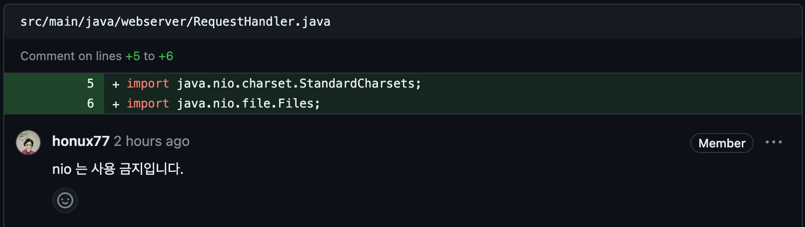

코드 리뷰 리팩토링
===

# Step -1

## 1) ThreadPool 사용


## ❌ 문제 상황

- concurrent 패키지의 threadPool에 대해 학습이 온전히 이루어지지 않은 채로, 구현을 하여 문제점이 발생하였다.
- newCachedThreadPool과 newFixedThreadPool, 그리고 직접 생성하는 ThreadPool의 차이를 이해하지 않고 사용하였다.

### ```newFixedThreadPool```

- 초기 스레드 개수는 0이고, 입력한 ```POOL_SIZE```만큼 코어 스레드가 할당된다.
- 스레드 개수보다 작업 개수가 많으면, 새 스레드를 생성한 후 작업 처리
- 이 떄, 최대 스레드 개수는 매개 값으로 준 ```POOL_SIZE```가 된다.

> 왜 이번 미션에서는 좋지 않은가?

- 해당 스레드풀에서는 스레드가 작업을 처리하지 않고 놀고 있더라도 스레드 개수가 줄지 않는다.

### ```newCachedThreadPool()```

- 초기 스레드 0, 코어 스레드 0으로 생성된다.
- 스레드 개수보다 작업 개수가 많으면 새 스레드가 생성된다.
- 이론적으로는 int값이 가질 수 있는 ```Interger.MAX_VALUE``` 값이지만, 운영체제에 따라 달라진다.
- [ ] 1개 이상의 스레드가 추가되었을 경우
    - [x] 60초 동안 추가된 스레드가 아무 작업을 하지 않을 경우, 추가된 스레드를 종료하고 pool에서 제거

> 요청이 단일적으로 .html 파일만 조회하고 회원가입을 하는 해당 프로젝트의 경우에는
> CachedThreadPool()을 사용하는 것이 효과적일 것이라고 생각했습니다.

### ```ThreadPoolExecutor 객체```

- newCachedThreadPool, newFixedThreadPool은 내부적으로 ThreadPoolExecutor 객체를 생성해서 리턴한다.

```
ExecutorService threadPool = new ThreadPoolExecutor(
    3,          // 코어 스레드 개수
    200,        // 최대 스레드 개수
    120L,       // 놀고 있는 시간
    TimeUnit.SECONDS,   // 놀고 있는 시간 단위
    new SynchronousQueue<Runnable>()    // 작업 큐
);
```

- 의 형태로 선언할 수 있다.

## ⭕️ 문제 개선

- 기존 newFixecThreadPool을 개선한다.
- ThreadPoolExecutor을 활용해서 직접 스레드 풀을 생성한다.
- ```CORE_THREAD_SIZE```, ```MAX_THREAD_SIZE```, ```REST_TIME```을 상수로 두어 관리한다.

```
ExecutorService executor = new ThreadPoolExecutor(
        CORE_THREAD_SIZE,          // 코어 스레드 개수
        MAX_THREAD_SIZE,        // 최대 스레드 개수
        REST_TIME,       // 놀고 있는 시간
        TimeUnit.SECONDS,   // 놀고 있는 시간 단위
        new SynchronousQueue<Runnable>()    // 작업 큐
);
```

---

## 2) ContentType Enum 사용


## ❌ 문제 상황

1) enum 클래스의 이름을 CONTENT_TYPE으로 설정

- 모두 대문자로 하여서.. 그리고 camelCase도 지키지 않았다

2) enum 클래스에서 단순히 값을 가져와서, content-type과 \r\n을 붙여주어 복잡도만 늘어나는 상황

## ⭕ 문제 개선

1) enum 클래스의 이름을 ContentType으로 변경
2) enum 클래스에서 type String 값이 들어오면, enum.name으로 조회하여, content-type을 반환하도록 간단히 구현
   ️

## 3) Route Enum 수정


## ❌ 문제 상황

1) enum 클래스의 이름을 ROUTE로 설정

- 모두 대문자로 하여서.. 그리고 camelCase도 지키지 않았다

2) STATIC 내부의 값들을 전부 매핑해줄 필요가 없다.
    - Honux의 피드백처럼, STATIC 내부의 경로는 모두 상대 경로로 동작하기 때문에
    - STATIC만 넘겨주면 동작 가능

## ⭕ 문제 개선

1) enum 클래스의 이름을 Route로 변경
2) Route Enum의 값을 STATIC, TEMPLATE으로 변경
    - STATIC 경로를 조회
    - TEMPLATE 경로를 조회
      가능하도록 설정

---

## 4) loggerDebug 함수


## ❌ 문제 상황

- logger.debug가 중복되는 것 같아 따로 메소드로 분리하였다.
- 하지만, 메소드로 분리하면서 불필요한 상수
    - REQUEST, HEADER 와 같은 상수들이 필요하게 되었다.

> 클린 코드를 지향하는..것? 처럼 보이는 코드라고 생각한다..

## ⭕ 문제 개선

- loggerDebug 메소드를 삭제
- logger.debug 메소드를 통해 로그를 출력하도록 개선

## 5) java.nio 사용



## ❌ 문제 상황

- 예제 코드를 무작정 사용하다 보니, java.nio 패키지의 Files.readAllBytes가 사용되었다.
- 다른 분들은 무사히(?) 넘어가신 분들도 있는데, Honux께서 내가 개선해야 할 부분들을 잘 말씀해주셔서 나는 정말 운이 좋다고 생각한다 😎
- 더욱 열심히 java.nio에 대해 알아보아야겠다. 🔥🔥🔥🔥


### java.nio 패키지란 무엇일까?

- java.nio는 다양한 버퍼 클래스를 제공한다.
- ```java.nio.file``` : 파일 및 파일 클래스에 접근하기 위한 클래스 라고 명시되어있다.

### io? nio? 무슨 차이일까?

- IO 와 NIO는 데이터를 입출력한다는 목적은 동일하다.
- 방식에 있어서 차이가 난다.

| 구분     | IO               | NIO           |
|--------|------------------|---------------|
| 입출력 방식 | 스트림 방식           | 채널 방식         |
| 버퍼 방식  | 넌 버퍼(non-buffer) | 버퍼(buffer)    |
| 비동기 방식 | 지원 X             | 지원 O          |
| 블로킹 방식 | 블로킹 방식만 지원       | 블로킹 / 넌블로킹 지원 |

### 스트림 vs 채널
- 채널 : 양방향으로 입력/출력이 가능하다.
- 스트림 : 단방향으로 입력/출력만 가능하다.

### 버퍼 vs 넌버퍼
- IO에도 기본적으로 BufferedStream...과 같은 보조 스트림 있다.
  - 이를 따로 보조적으로 구현해주어야 한다.
- NIO는 기본적으로 버퍼를 사용해서 입출력을 한다.

### 블로킹 vs 넌블로킹
- IO는 블로킹된다.
  - 블로킹 : IO가 입력/출력이 끝날 때 까지 IO의 return을 기다린다.
- NIO는 블로킹 될 수도, 넌블로킹 될 수도 있다.
  - 넌블로킹 : file NIO를 실행해도, NIO를 호출한 함수는 그대로 자신의 스레드를 실행한다.

### IO vs NIO 어떨 때 사용하는가?
> 왜 이번 프로젝트에서는 nio 패키지를 사용하지 말아야할까? 
> 
> 에 대한 궁금증을 해결해보자

- NIO : 연결 클라이언트 수가 많고, 하나의 입출력 작업이 오래 걸리지 않는 경우 사용 용이
- IO : 연결 클라이언트 수가 적고, 전송되는 데이터가 대용량이면서 순차적으로 처리될 필요성이 있는 경우 용이

>
>이번 프로젝트에서는 localhost에서 동작하는 서버이기 때문에, 연결 호스트이 수가 적다.
>
>또한, 전송되는 데이터가 text 파일만 있는 .html 파일이라면 그 크기가 작겠지만
>
>전송되는 .html 파일에 다양한 css 파일을 로드하고, ico, svg와 같은 이미지 파일들이 많이 로드되게 되면
>
>그것은 대용량 파일로 간주될 수 있기 때문에 페이지를 로드하는 과정에서 안전하게 파일 입출력을 처리하기 위해 java.nio 사용을
>
>지양하라고 하신 것 같다!

## ⭕️ 문제 개선
- ```File file = new File(path)```을 이용해서 파일을 생성
- ```FileInputStream```을 사용해서 File을 읽어온다.
- ```BufferedInputStream```을 사용해서 FileInputStream을 버퍼로 읽어온다.
  - 입출력 속도를 줄이기 위해 buffer를 사용
